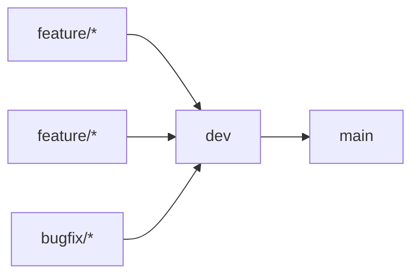

# Clippy Backend
   

This is repository contains code for backend of project [Clippy: smart PDF reader for better paper reading experience and knowledge mining](https://conf.researchr.org/track/icse-2023/icse-2023-score-2023#clippy:-smart-pdf-reader-for-better-paper-reading-experience-and-knowledge-mining). 
## Contents

 - [Application](#application)
	 - [Tools](#tools)
	 - [Services](#services)
 - [Development](#development)
	 - [Branching](#branching)
 - [Hosting](#hosting)
	 - [Heroku](#heroku)
	 - [Environments](#environments)
	 - [Variables](#variables)

## [Application](#development)

### [Tools](#tools)

- Git for version control.
- [Zenhub](https://app.zenhub.com/workspaces/clippy-63600767a63c240a624ccea7/board) in addition to GitHub board for tracking work items and SCRUM organisation.
- [SonarCloud](https://sonarcloud.io/project/overview?id=clippydsdone_clippy-backend) for code quality check.
- [NodeJS](https://nodejs.org/en/) is a JavaScript runtime built on Chrome's V8 JavaScript engine.
- [Axios](https://axios-http.com/docs/intro) a promise-based HTTP Client for node.js and the browser.

### [Services](#services)
- [Semantic Scholar](https://www.semanticscholar.org/about) provide records for research papers published in all fields provided as an easy-to-use JSON archive.
- [Hugging Face]() a community and data science platform that provides: tools that enable users to build, train and deploy ML (Machine Learning) models based on open source (OS) code and technologies, as well as a place where a broad community of data scientists, researchers, and ML engineers can come together and share ideas, get support and contribute to open source projects.

## [Development](#development)
### [Branching](#branching)

There are only 2 long-standing (remote) branches:   

1. **dev**: Contains all the code in the current SCRUM iteration.
2. **main**: Contains the release for the previous SCRUM iteration.

There are only 2 types of temporary branches:

1. **feature/(IssueId)-(issue-name)**: Contains current work being developed for the Issue. Example of valid feature branch name for issue `Setup repo and wiki` with ID `22` would be `feature/22-setup-repo-and-wiki`
2. **bugfix/(IssueId)-(issue-name)**: Contains current work being developed for the Issue of type `Bug`. Example of valid feature branch name for issue `PDF.js not rendering` with ID `42` would be `bugfix/42-pdf-js-not-rendering`

When issues are closed temporary branches are **squashed and deleted**.

## [Hosting](#hosting)
### [Heroku](#heroku)
Clippy respository is setup for hosting to [Heroku](https://dashboard.heroku.com) with heroku/nodejs buildpack. 
### [Environments](#environments)
There are two Clippy hosting environments: 

 - Development: Environment that is hosted from the dev branch and PRs.
 - Production: Environment that is hosted from the main branch (release).

### [Variables](#variables)
All environment variables needed for hosting Clippy are defined in GitHub secrets.
| Keys | Description |
|--|--|
|  `ALLOWED_ORIGINS`| CORS header for allowed origins. Value them accordingly for PDF.js|
|  `HEROKU_API_KEY`|  API key for the Heroku container that application is deployed to.|
|  `HEROKU_APP_NAME`|  Name of the Heroku container that application is deployed to. (PRODUCTION)|
|  `HEROKU_APP_NAME_DEV`| Name of the Heroku container that application is deployed to. (DEVELOPMENT)|
|  `SEMANTIC_SCHOLAR_API_KEY`| API key for the Semantic Scholar API |
|  `SONAR_TOKEN`| Token for SonarCloud service. |
